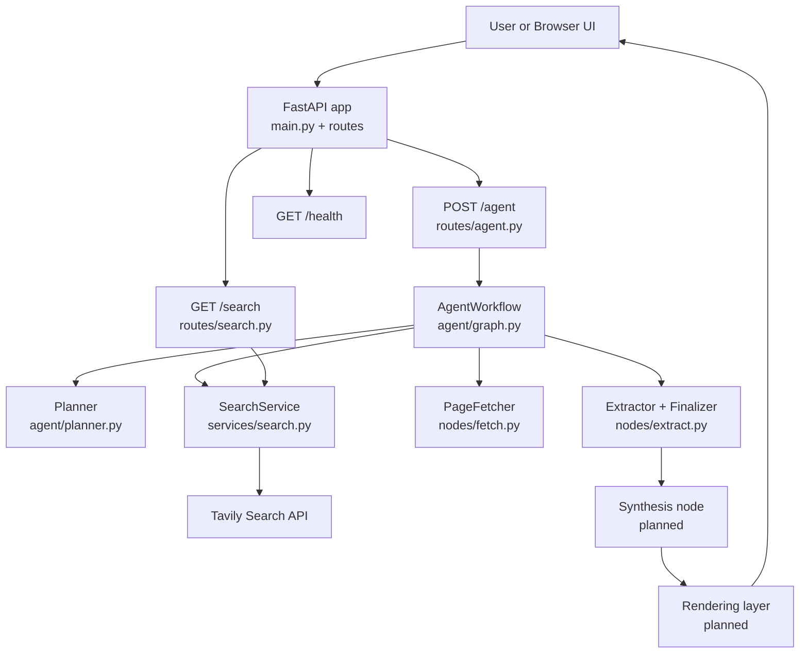
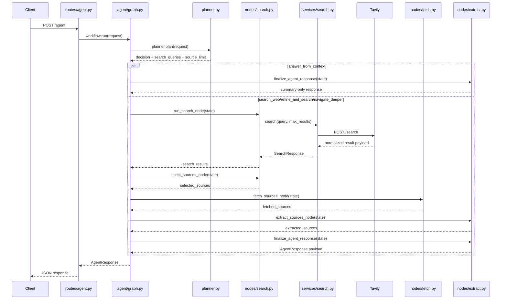
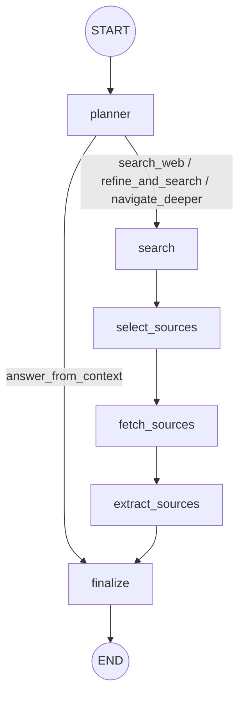

# Agentic Browser Design

## Purpose

This document describes the system design for the Agentic Browser MVP and the technical choices behind the current scaffold and the next agentic architecture step.

## Current Implementation Status

The following parts of the design are now implemented:

- `src`-layout Python package structure
- environment-backed settings
- FastAPI app bootstrap
- `GET /` metadata endpoint
- `GET /health` health endpoint
- smoke tests for the current API surface
- an initial search route contract and normalized search result model
- an initial LangGraph agent loop with planner, search, fetch, and extraction nodes

The current codebase now includes an initial agent decision loop, but structured page synthesis, final HTML rendering, and navigation are still planned rather than complete.

## Architecture Summary

The application is a server-rendered web app with a modular backend. The target architecture is an agentic pipeline where the backend accepts user prompts, decides whether retrieval is needed, gathers evidence through tools, synthesizes a structured page plan, and renders the result into HTML templates.

## Mermaid Diagrams

If these docs are rendered in a browser-based docs shell, `docs\addmermaid.js` can turn Mermaid code blocks into diagrams automatically.

### High-Level System Diagram



### Current Code Flow



### LangGraph Shape



## High-Level Flow

1. User submits a prompt from the browser UI.
2. FastAPI route receives the request.
3. Planner decides whether the prompt requires retrieval.
4. If needed, search and fetch tools gather candidate sources and page assets.
5. Extractor pulls text, structure, images, and style signals from selected sources.
6. Synthesizer prepares a prompt and requests structured output from the LLM.
7. Renderer converts structured data into HTML.
8. Generated links embed enough metadata to continue the navigation journey.

## Current vs Target Architecture

### Current

- HTTP scaffold and settings
- root and health endpoints
- initial `GET /search` route
- initial `POST /agent` route
- Tavily-backed search service
- normalized search result models
- LangGraph state and a constrained agent workflow

### Target

- planner that decides when retrieval is needed
- retrieval orchestrator that can search, fetch, and extract
- evidence store for selected sources and extracted assets
- synthesizer that outputs structured page data
- renderer that assembles the final generated page

## Orchestration Choice

The chosen orchestration layer for the agentic workflow is **LangGraph**.

Why LangGraph fits this project:

- the workflow is naturally stateful
- nodes map cleanly to planner, search, fetch, extract, synthesize, and render stages
- routing decisions are first-class, which matches the need to decide whether retrieval is required
- the navigation experience can reuse the same graph with updated context
- graph state makes it easier to inspect why a page was generated in a particular way

## Major Components

### Web Application Layer

- `FastAPI` handles HTTP routing and lifecycle concerns.
- Route modules remain thin and delegate to services.

Why FastAPI is still needed:

- it is the HTTP boundary for the browser-facing product
- it receives prompts, clicks, and navigation intents
- it invokes the LangGraph workflow and returns responses
- it serves as the stable shell for health checks, configuration, and future page-rendering endpoints

FastAPI is therefore not the agent implementation itself. It is the server layer that hosts and exposes the agent.

### Configuration Layer

- Centralized settings are loaded from environment variables.
- Runtime configuration includes host, port, debug mode, app name, and future API credentials.

### Search Service

- Responsible for provider integration, request shaping, result normalization, and provider-specific error handling.
- Current provider target: Tavily Search API.

### Planner

- Responsible for deciding whether a prompt needs search or can continue from current context.
- Produces tool decisions rather than directly rendering output.

### Retrieval Orchestrator

- Coordinates search, page fetch, extraction, and evidence collection.
- Acts as the execution layer for planner decisions.

### LangGraph State

The graph state should eventually include:

- current prompt
- current page context
- planner decision
- rewritten queries
- selected sources
- extracted evidence
- media/style hints
- structured render plan
- navigation intent

### Scraper Service

- Responsible for downloading page content and extracting meaningful text.
- Initial approach: `httpx` and `BeautifulSoup4`.
- Optional fallback: browser automation with Playwright for difficult pages.

### Synthesis Service

- Responsible for prompt construction, source aggregation, and calling the LLM.
- The LLM must return structured content rather than raw HTML.

### Rendering Layer

- Template-based rendering converts a trusted internal page model into consistent HTML.
- This is preferred over directly rendering arbitrary LLM HTML in the MVP.

### Context Management

- A lightweight context object captures query history and navigation state.
- Generated hyperlinks should reference context identifiers or encoded navigation intents.
- Agent state should also track whether retrieval occurred, which sources were selected, and what evidence informed the rendered page.

## Agentic Workflow with LangGraph

Suggested first graph:

1. **Input node**: receives user prompt and existing context
2. **Planner node**: decides `answer_from_context`, `search_web`, `refine_and_search`, or `navigate_deeper`
3. **Search node**: issues one or more search queries when needed
4. **Source selection node**: chooses a bounded set of promising sources
5. **Fetch node**: downloads source pages
6. **Extraction node**: extracts text, citations, images, and style cues
7. **Synthesis node**: produces structured page data
8. **Render node**: builds the final HTML page
9. **Navigation node**: feeds user clicks back into the graph for the next turn

The initial implementation should keep the graph simple and deterministic where possible. LLM decisions should be constrained by structured outputs and bounded tool usage.

### Current File-to-Responsibility Map

- `src\agentic_browser\main.py`: creates the FastAPI app and includes routes
- `src\agentic_browser\routes\agent.py`: accepts `POST /agent` requests and invokes the workflow
- `src\agentic_browser\routes\search.py`: debug/internal route for direct search calls
- `src\agentic_browser\agent\graph.py`: builds and runs the LangGraph workflow
- `src\agentic_browser\agent\planner.py`: makes the current heuristic planner decision
- `src\agentic_browser\agent\nodes\search.py`: executes search and source selection
- `src\agentic_browser\agent\nodes\fetch.py`: fetches the selected source pages
- `src\agentic_browser\agent\nodes\extract.py`: extracts evidence and assembles the final response payload
- `src\agentic_browser\services\search.py`: provider integration and search result normalization

## Initial Package Layout

```text
agentic-browser/
├── docs/
├── src/
│   └── agentic_browser/
│       ├── routes/
│       ├── services/
│       ├── rendering/
│       └── models/
├── tests/
├── .env.example
├── pyproject.toml
├── requirements.txt
└── run.py
```

## Phase 1 Design Decisions

### 1. `src` Layout

A `src` layout helps avoid accidental imports from the repository root and is a solid baseline for packaging and tests.

### 2. Simple FastAPI Entry Point

Phase 1 keeps the app boot path minimal:

- `agentic_browser.config` loads settings.
- `agentic_browser.main` creates the FastAPI app.
- `agentic_browser.routes.health` exposes a health endpoint.

### 3. Pydantic Settings

Environment-backed settings provide typed configuration and keep secrets out of source control.

### 4. Template-First Rendering Strategy

Even though rendering is not implemented in Phase 1, the design assumes structured data rendered by templates. This reduces prompt risk, improves consistency, and keeps styling under application control.

## API Surface for Phase 1

### `GET /`

Returns a small JSON payload confirming the application is running and identifying the project.

### `GET /health`

Returns a lightweight health response suitable for local checks and future readiness probes.

## Repository Workflow Notes

- The project now lives in the personal GitHub repository `kunalchaturvedi/agentic-browser`.
- The initial scaffold was published on branch `phase1-foundation`.
- Pull request `#1` tracks the merge of the Phase 1 foundation work into `main`.

## Current Routes

- `GET /search`
- `POST /agent`
- `GET /`
- `GET /health`

## Future Routes

- `POST /search`
- `GET /page/{page_id}`
- `POST /navigate`

The remaining routes are deferred until the LangGraph planner, retrieval loop, extraction, synthesis, and rendering layers are implemented.

## Data Model Direction

The initial internal page model should eventually support:

- query metadata
- page title
- hero summary
- ordered sections
- source citations
- related links with navigation intent

## Error Handling Strategy

- Configuration errors should fail fast at startup.
- External service errors should be surfaced explicitly and mapped to useful HTTP responses.
- The MVP should avoid broad catch-and-ignore patterns.

## Security and Safety Notes

- Secrets must come from environment variables.
- Rendered HTML should come from trusted templates and escaped content.
- External content extraction should be sanitized before use.

## Local Development Plan

- Install dependencies.
- Copy `.env.example` to `.env`.
- Run `python run.py`.
- Verify `GET /health`.

## Runtime Baseline

Phase 1 targets Python 3.9+ so the local scaffold remains compatible with the currently available interpreter while keeping the codebase ready for newer Python versions later.

## Open Design Items

- Session storage format for navigation and agent state.
- Search result selection strategy before synthesis.
- Planner prompt and decision schema.
- Structured output schema for the synthesizer.
- Template composition for synthesized pages.
- Exact LangGraph node boundaries and retry behavior.

## Implementation Roadmap

### Phase 1: Foundation

- project scaffold
- FastAPI app
- config and environment setup
- health endpoint
- smoke tests

Status: complete

### Phase 2: Search Slice

- normalized search models
- search service
- `GET /search`
- tests for normalization and route behavior

Status: complete as an initial slice

### Phase 3: LangGraph Agent Loop

- LangGraph state definition
- planner node
- search/fetch/extract nodes
- evidence assembly
- graph transition tests

Status: initial slice implemented

### Phase 4: Structured Page Synthesis

- synthesis node outputs structured page data
- page schema for title, sections, links, citations, media, and theme
- validation of structured outputs

Status: next

### Phase 5: Rendering Engine

- render structured page data into HTML
- support cards, sections, citations, media, and theme
- keep the output webpage-like instead of chat-like

Status: planned

### Phase 6: Context-Aware Navigation

- feed clicks and follow-up prompts back into the graph
- preserve page and evidence context
- support drill-down navigation

Status: planned

### Phase 7: Asset and Style Refinement

- improve image selection
- improve style extraction from sources
- refine page theming and layout quality

Status: planned

### Phase 8: Evaluation and Optimization

- quality evaluation
- latency tuning
- caching
- cost controls
- robustness improvements

Status: planned
