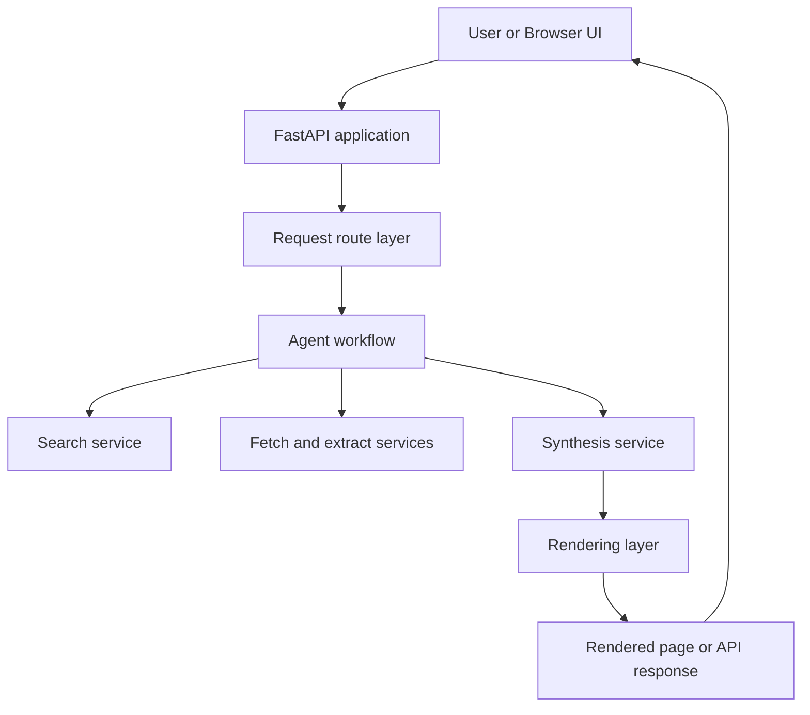
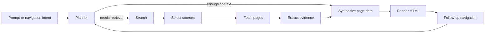

# Agentic Browser Design

## Purpose

This document describes the target system architecture, major components, and technical decisions behind Agentic Browser.

It focuses on **what the system is** and **why it is designed this way**.

For implementation phases and project progress, see `docs\implementation_plan.md`.

## System Summary

Agentic Browser is designed as a local-first web application that accepts a user prompt, decides whether retrieval is needed, gathers evidence from the web, synthesizes structured content, and renders the result as a webpage-like experience.

The main architectural idea is to keep the product split into two clear layers:

- a web application boundary that handles requests and responses
- an internal agent workflow that plans, retrieves, synthesizes, and renders

## Current Implementation Boundary

The `main` branch currently implements the foundation layer only:

- FastAPI application bootstrap
- environment-backed configuration
- root and health routes
- baseline tests

The design below describes the intended architecture beyond the current scaffold.

## Design Principles

### Local-first development

The system should be easy to run on a local machine with minimal setup and environment-based configuration.

### Webpage-style output

The result should feel like a generated webpage, not a chat transcript.

### Structured rendering

LLM output should be transformed into structured data and rendered through controlled templates instead of returning arbitrary raw HTML directly.

### Explicit workflow boundaries

Search, extraction, synthesis, rendering, and navigation should be isolated so they can evolve independently.

### Inspectable orchestration

As the system becomes more agentic, state transitions should remain visible and debuggable rather than hidden inside opaque control flow.

## High-Level Architecture



## Target Agentic Workflow



## Component Responsibilities

### Web application layer

- hosts the HTTP API
- accepts prompts and future navigation events
- returns debug JSON or rendered pages
- provides health and lifecycle endpoints

FastAPI is the right fit here because it gives a simple, typed server layer without forcing frontend complexity too early.

### Configuration layer

- loads typed settings from environment variables
- centralizes host, port, debug mode, and provider configuration
- keeps secrets out of source control

### Planner

- decides whether the system can answer from current context or needs retrieval
- may rewrite queries or route into a deeper navigation path
- returns structured decisions rather than final text

### Retrieval layer

- queries a search provider
- ranks and selects promising sources
- fetches selected pages
- extracts useful text, metadata, images, and style cues

### Synthesis layer

- converts evidence into structured page data
- produces titles, summaries, sections, cards, citations, and navigation intents
- keeps generation bounded by a known schema

### Rendering layer

- converts structured page data into HTML
- keeps layout, styling, and safety under application control
- preserves a webpage-like presentation rather than chat output

### Context and navigation layer

- tracks enough state for follow-up prompts and link-based navigation
- allows future turns to reuse evidence or gather additional evidence
- makes the browsing journey coherent across generated pages

## Recommended Internal Orchestration

The target workflow is a good fit for **LangGraph** or another explicit state-machine style orchestrator.

Why:

- the workflow is stateful
- routing decisions are first-class
- the system naturally maps to bounded nodes like planner, search, fetch, extract, synthesize, and render
- graph state is easier to debug than hidden agent loops

The project should prefer a constrained graph over an open-ended autonomous loop.

## Package Direction

### Current package shape

```text
agentic-browser/
├── docs/
├── src/
│   └── agentic_browser/
│       ├── routes/
│       ├── rendering/
│       └── services/
├── tests/
├── .env.example
├── pyproject.toml
├── requirements.txt
└── run.py
```

### Target package direction

```text
agentic-browser/
├── docs/
├── src/
│   └── agentic_browser/
│       ├── agent/
│       ├── models/
│       ├── rendering/
│       ├── routes/
│       └── services/
├── tests/
├── .env.example
├── pyproject.toml
├── requirements.txt
└── run.py
```

## Error Handling Strategy

- fail fast on invalid configuration
- surface provider failures explicitly
- avoid broad catch-and-ignore patterns
- preserve enough detail for local debugging

## Security and Safety Notes

- secrets must come from environment variables
- structured rendering is preferred over raw LLM HTML
- extracted external content should be sanitized before rendering

## Open Design Questions

- what session storage model should back navigation context
- how source selection should be ranked before synthesis
- what structured page schema should be used for synthesis output
- how much style extraction should influence rendering in the early versions
