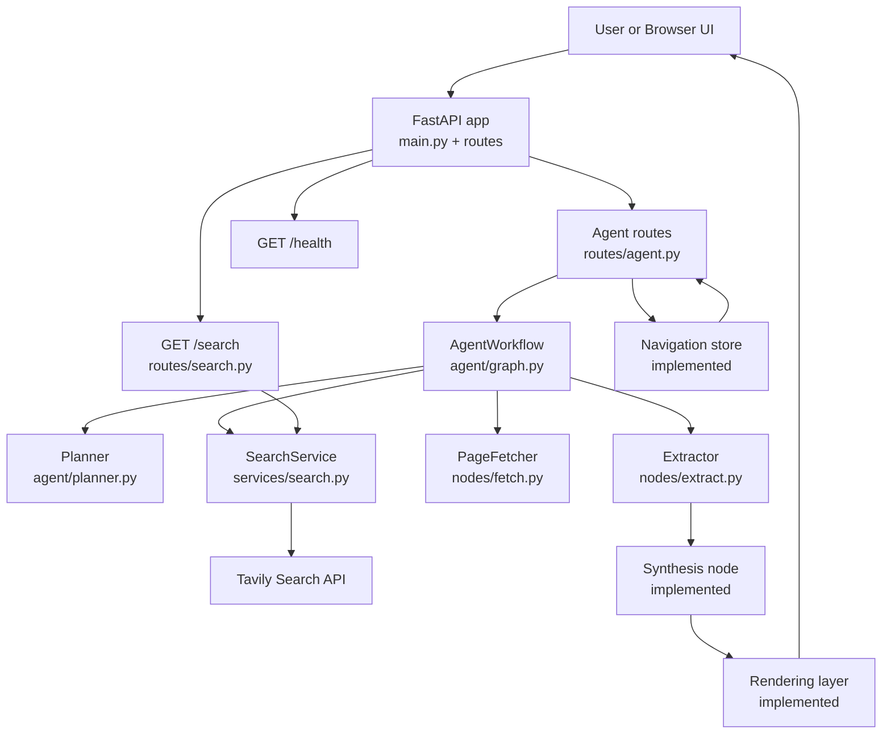
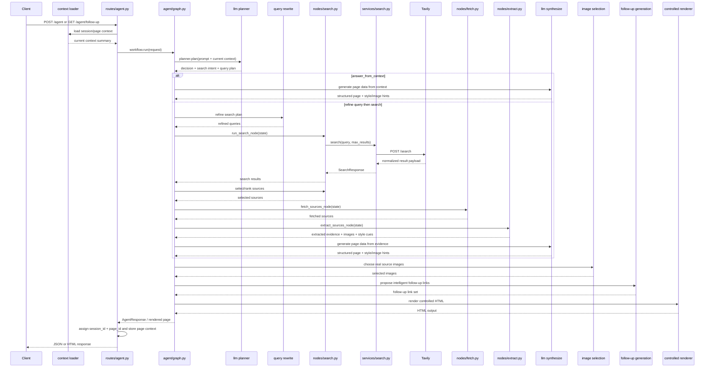

# Agentic Browser Design

## Purpose

This document describes the current system architecture, target architecture, and technical rationale behind Agentic Browser.

It focuses on **how the system is structured** and **why the project is organized this way**.

For implementation phases and milestone tracking, see `docs\implementation_plan.md`.

## Current Implementation Boundary

The current codebase includes:

- FastAPI application bootstrap
- environment-backed configuration
- `GET /`, `GET /health`, `GET /search`, `POST /agent`, `POST /agent/render`, `GET /agent/pages/{session_id}/{page_id}`, and `GET /agent/follow-up`
- Tavily-backed search integration
- initial Azure AI Foundry-backed planner and synthesis options using GPT-4.1 mini
- normalized search, agent, and page response models
- an initial LangGraph workflow with planner, search, fetch, extraction, synthesis, and finalize nodes
- a deterministic renderer that turns structured page data into a polished editorial-style HTML page
- a lightweight in-memory navigation layer that preserves page and session continuity
- terminal-visible request and workflow logging
- debug-gated raw planner-response logging for local LLM inspection
- tests for health, search, planner behavior, workflow execution, page-model validation, rendering, navigation continuity, and planner/synthesis parsing and fallback behavior

Explicit tool orchestration, more intentional follow-up navigation, and independent planner/synthesis model tuning are still planned beyond the current slice.

## System Summary

Agentic Browser is designed as a local-first web application that accepts a user prompt, decides whether retrieval is needed, gathers evidence from the web, synthesizes structured page data, and eventually renders the result as a webpage-like experience.

The main architectural split is:

- a web application boundary that handles requests and responses
- an internal agent workflow that plans, retrieves, synthesizes, and renders

## Mermaid Diagrams

If these docs are rendered in a browser-based docs shell, `docs\addmermaid.js` can turn Mermaid code blocks into diagrams automatically.

### High-Level System Diagram



### Planned Phase 7 Code Flow



### Planned Phase 7 LangGraph Shape

```mermaid
flowchart LR
    Start((START)) --> ContextNode[load_context]
    ContextNode --> PlannerNode[llm_planner]

    PlannerNode -->|answer_from_context| SynthesizeNode[llm_synthesize]
    PlannerNode -->|search_needed| SearchNode[search]
    PlannerNode -->|refine_then_search| RewriteNode[query_rewrite]

    RewriteNode --> SearchNode
    SearchNode --> SelectSources[select_rank_sources]
    SelectSources --> FetchSources[fetch_sources]
    FetchSources --> ExtractSources[extract_sources]
    ExtractSources --> SynthesizeNode

    SynthesizeNode --> ImageNode[select_images]
    ImageNode --> FollowupsNode[generate_followups]
    FollowupsNode --> RenderNode[controlled_render]
    RenderNode --> Finalize
    Finalize --> End((END))
```



## Design Principles

### Local-first development

The system should be easy to run on a local machine with minimal setup and environment-based configuration.

### Webpage-style output

The result should feel like a generated webpage, not a chat transcript.

### Structured rendering

LLM output should be transformed into structured data and rendered through controlled templates instead of returning arbitrary raw HTML directly.

### Explicit workflow boundaries

Search, extraction, synthesis, rendering, and navigation should be isolated so they can evolve independently.

### Inspectable orchestration

As the system becomes more agentic, state transitions should remain visible and debuggable rather than hidden inside opaque control flow.

## Component Responsibilities

### Web application layer

- hosts the HTTP API
- accepts prompts and future navigation events
- returns debug JSON or rendered pages
- provides health and lifecycle endpoints

FastAPI provides the browser-facing shell around the agent workflow.

### Configuration layer

- loads typed settings from environment variables
- centralizes host, port, base URL, debug mode, and provider configuration
- keeps secrets out of source control

### Search service

- integrates with the current search provider
- shapes provider requests and normalizes returned results
- maps provider-specific failures into application-visible errors

The current provider target is **Tavily**.

### Planner

- decides whether the system can answer from current context or needs retrieval
- may rewrite queries or route into a deeper navigation path
- returns structured decisions rather than final text

This layer now supports an initial LLM-backed planner slice through Azure AI Foundry with GPT-4.1 mini, while keeping the heuristic planner as a fallback. Later work should extend that into explicit tool orchestration and follow-up generation.

For local developer ergonomics, the planner path is now observable through:

- explicit logs showing whether the heuristic planner, Azure planner, or heuristic fallback path was used
- debug-only logging of the raw Azure planner response payload
- a standalone Azure connection-check script for verifying deployment reachability before full graph testing

Current limitation:

- planner and synthesis share the same Azure deployment setting today, so the planner cannot yet be optimized independently for low latency while synthesis is optimized independently for page quality

### Retrieval layer

- queries the search provider
- selects promising sources
- fetches selected pages
- extracts text, metadata, images, and style cues

### Synthesis layer

- converts evidence into structured page data
- produces titles, summaries, sections, citations, related links, and theme hints
- keeps generation bounded by a known schema

This layer now supports an initial Azure AI Foundry-backed synthesis path while preserving a bounded `SynthesizedPage` contract and deterministic fallback behavior. Later work should improve prompt quality, explicit tool orchestration, and richer follow-up generation on top of that slice.

This is also the main quality-sensitive LLM step, so it is the most likely candidate for a stronger model once planner and synthesis can be configured independently.

### Rendering layer

- converts structured page data into HTML
- keeps layout, styling, and safety under application control
- preserves a webpage-like presentation rather than chat output

This layer is now implemented as a deterministic renderer with a polished visual design pass and room for future render strategies. The current design direction is to let the LLM provide structured content plus image/style hints, while the application continues to control final HTML/CSS rendering.

Rendered internal navigation links now use a configured application base URL so generated pages can continue routing back into the local app even when the HTML is saved and opened separately during development.

### Context and navigation layer

- tracks enough state for follow-up prompts and link-based navigation
- allows future turns to reuse evidence or gather additional evidence
- makes the browsing journey coherent across generated pages

This layer is now implemented as an initial in-memory continuity slice. A later LLM phase should make follow-up links more intentional by generating likely next exploration paths instead of only mirroring retrieved sources.

## Planned LLM Evolution

The next major architecture step is a phased LLM upgrade:

### Phase 7A: LLM reasoning and page generation

- reason over the prompt and current page/session context
- decide whether web search is needed
- use web search as a bounded tool when helpful
- generate structured page data plus image/style hints
- keep rendering controlled by the application

Current checkpoint within Phase 7A:

- planner reasoning is implemented
- the first LLM-backed synthesis path is implemented
- deterministic fallback remains in place for both planner and synthesis
- explicit query-rewrite/tool-orchestration is still the next sub-slice

### Phase 7B: Intelligent follow-up navigation

- generate follow-up links based on what the user is likely to want next
- keep those links bounded and compatible with the current continuity model
- preserve inspectability of why a next-step link was offered

### Phase 9: Model evaluation and optimization

- split planner and synthesis into separate deployment settings
- evaluate a smaller planner model such as `gpt-5-nano`
- compare synthesis quality, latency, JSON reliability, and fallback rate across candidate models
- optimize for better page quality without materially hurting interactive load time

## Recommended Internal Orchestration

The workflow is a strong fit for **LangGraph** because:

- the workflow is stateful
- routing decisions are first-class
- the system naturally maps to bounded nodes like planner, search, fetch, extract, synthesize, and render
- graph state is easier to debug than hidden agent loops

The project should prefer a constrained graph over an open-ended autonomous loop.

## Current File-to-Responsibility Map

- `src\agentic_browser\main.py`: creates the FastAPI app and includes routes
- `src\agentic_browser\routes\agent.py`: accepts `POST /agent` requests and invokes the workflow
- `src\agentic_browser\routes\agent.py`: also exposes rendering, stored-page, and follow-up navigation routes
- `src\agentic_browser\routes\search.py`: debug/internal route for direct search calls
- `src\agentic_browser\agent\graph.py`: builds and runs the LangGraph workflow
- `src\agentic_browser\agent\planner.py`: runs the current planner path with Azure-backed planning plus heuristic fallback
- `src\agentic_browser\agent\nodes\search.py`: executes search and source selection
- `src\agentic_browser\agent\nodes\fetch.py`: fetches the selected source pages
- `src\agentic_browser\agent\nodes\extract.py`: extracts evidence and assembles the final response payload
- `src\agentic_browser\agent\nodes\synthesize.py`: turns extracted evidence into structured page data
- `src\agentic_browser\services\search.py`: provider integration and search result normalization
- `src\agentic_browser\rendering\html.py`: deterministic HTML renderer for `SynthesizedPage`
- `src\agentic_browser\navigation\store.py`: lightweight in-memory page/session continuity store

## Package Direction

```text
agentic-browser/
├── docs/
├── src/
│   └── agentic_browser/
│       ├── agent/
│       ├── navigation/
│       ├── models/
│       ├── rendering/
│       ├── routes/
│       └── services/
├── tests/
├── .env.example
├── pyproject.toml
├── requirements.txt
└── run.py
```

## Error Handling Strategy

- fail fast on invalid configuration
- surface provider failures explicitly
- avoid broad catch-and-ignore patterns
- preserve enough detail for local debugging

## Security and Safety Notes

- secrets must come from environment variables
- structured rendering is preferred over raw LLM HTML
- extracted external content should be sanitized before rendering

## Open Design Questions

- what validated page schema should the synthesis step produce long-term
- how source selection should evolve before synthesis
- how much style extraction should influence rendering in early versions
- what session storage model should back navigation context
