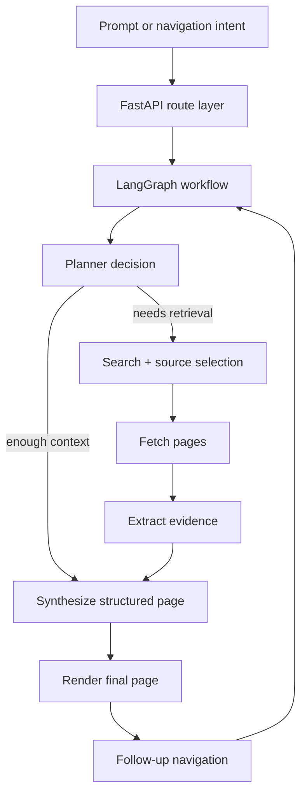
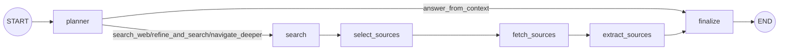
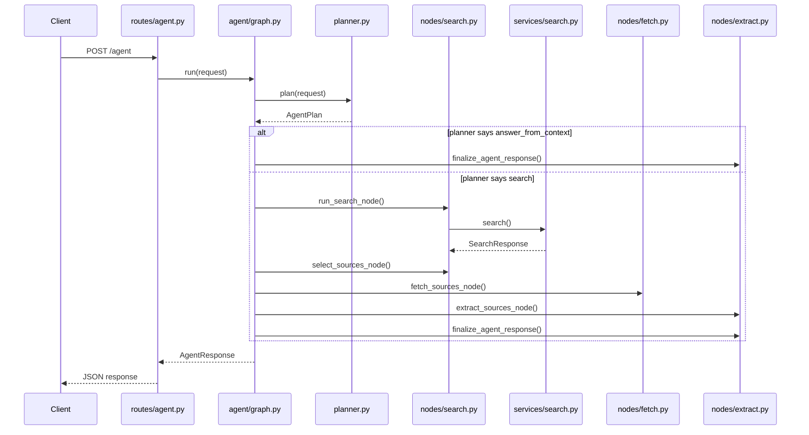

# Agentic Browser Implementation Plan

## Purpose

This document captures the long-term implementation plan for Agentic Browser as an **agentic webpage-generation system**, not just a search UI with rendering.

The current codebase already includes:

- Phase 1 foundation scaffolding
- an initial search slice
- a `GET /search` route
- search models and tests

The next goal is to evolve that prototype into a true agentic workflow.

## Current System vs Target System

### Current System

The current system is a **search-enabled prototype**:

- FastAPI application scaffold
- environment-based configuration
- health and root endpoints
- Tavily-backed search service
- normalized search results
- tests for route behavior and normalization

### Target System

The target system is an **agentic browser pipeline**:

1. user submits a prompt
2. planner decides whether web retrieval is needed
3. the system searches, fetches, and extracts evidence when necessary
4. the system synthesizes a structured page plan
5. the system renders a new webpage
6. navigation actions feed back into the same loop with updated context

## Orchestration Choice

Use **LangGraph** as the orchestration layer.

### Why LangGraph

- the workflow is stateful
- each step maps naturally to a graph node
- planner decisions need explicit routing
- navigation can reuse the same graph with updated state
- graph execution is easier to inspect and debug than hidden control flow

### Recommended Graph Style

Use a **constrained graph**, not an open-ended autonomous agent loop.

Recommended nodes:

- planner
- search
- source selection
- fetch
- extract
- synthesize
- render
- navigate

Avoid for now:

- free-form ReAct loops
- heavy abstractions that hide graph state
- multi-agent systems unless a real coordination problem appears later

## Why FastAPI Is Still Needed

FastAPI is the web application shell, not the agent.

We still need it because it:

- exposes HTTP endpoints for prompts and navigation
- receives browser requests and returns responses
- invokes the LangGraph workflow for each user interaction
- provides health endpoints and application lifecycle handling
- gives us a clean place to host future rendered-page endpoints

The split of responsibilities is:

- **FastAPI** = web server and API boundary
- **LangGraph** = internal agent workflow and state transitions

## Model Recommendation

Start with one strong Azure-hosted model for the first end-to-end loop:

- use a capable Azure OpenAI model such as `GPT-4.1`
- use it for both planner decisions and structured page synthesis

Later, if cost or latency becomes important, split responsibilities:

- smaller model for planning and query rewriting
- stronger model for structured page synthesis

## Agentic Workflow

### Mermaid Overview



### Current Implemented LangGraph



### Step 1: Input

- user submits a prompt or clicks a generated navigation link
- request enters the FastAPI app

### Step 2: Planner

- planner receives prompt plus current page/session context
- planner returns a structured decision such as:
  - `answer_from_context`
  - `search_web`
  - `refine_and_search`
  - `navigate_deeper`

### Step 3: Retrieval

If retrieval is needed:

- issue one or more search queries
- rank and select candidate sources
- fetch the selected pages

### Step 4: Extraction

- extract clean text
- collect citations and metadata
- collect useful images
- collect visual/style cues such as layout hints, dominant colors, or hero imagery

### Step 5: Evidence Assembly

- gather chosen sources
- assemble extracted text and metadata
- preserve media/style hints
- build a clean evidence packet for synthesis

### Step 6: Structured Page Synthesis

- LLM converts the evidence packet into structured page data
- output should include:
  - title
  - summary
  - ordered sections
  - cards or content blocks
  - citations
  - related links
  - image placements
  - theme/style guidance

### Step 7: Rendering

- renderer converts structured page data into HTML/CSS
- output should feel like a webpage, not a chat response

### Step 8: Navigation Loop

- user clicks a generated link or submits a follow-up prompt
- the graph receives updated context
- planner decides whether to reuse evidence, gather more evidence, or render directly

## LangGraph State Model

The graph state should eventually include:

- current prompt
- session/page context
- planner decision
- rewritten queries
- selected sources
- fetched page metadata
- extracted evidence
- image candidates
- style/theme hints
- structured render plan
- navigation intent

## Phase Roadmap

### Phase 1: Foundation

- project scaffold
- FastAPI app
- config and environment setup
- health endpoint
- smoke tests

Status: complete

### Phase 2: Search Slice

- normalized search models
- search service
- `GET /search`
- tests for normalization and route behavior

Status: complete as an initial slice

### Phase 3: LangGraph Agent Loop

- LangGraph state definition
- planner node
- search node
- source selection node
- fetch node
- extraction node
- evidence assembly
- graph transition tests

Status: initial slice implemented

### Phase 4: Structured Page Synthesis

- synthesis node outputs structured page data
- page schema for title, sections, links, citations, media, and theme
- validation of structured outputs

Status: next

### Phase 5: Rendering Engine

- render structured page data into HTML
- support cards, sections, citations, media, and theme
- keep the output webpage-like instead of chat-like

Status: planned

### Phase 6: Context-Aware Navigation

- feed clicks and follow-up prompts back into the graph
- preserve page and evidence context
- support drill-down navigation

Status: planned

### Phase 7: Asset and Style Refinement

- improve image selection
- improve style extraction from sources
- refine page theming and layout quality

Status: planned

### Phase 8: Evaluation and Optimization

- quality evaluation
- latency tuning
- caching
- cost controls
- robustness improvements

Status: planned

## Near-Term Build Order

1. Add LangGraph dependency and graph state definitions.
2. Create the planner node and planner output schema.
3. Wire search results into graph execution.
4. Add fetch and extraction nodes.
5. Add evidence assembly and structured synthesis.
6. Add the first end-to-end rendered page path.
7. Add navigation back into the graph.

## Concrete Changes for the Next Phase

### New packages and files

Planned additions:

```text
src/agentic_browser/
├── agent/
│   ├── __init__.py
│   ├── state.py
│   ├── graph.py
│   ├── planner.py
│   └── nodes/
│       ├── __init__.py
│       ├── search.py
│       ├── fetch.py
│       └── extract.py
```

### Models to add or extend

Planned model work:

- planner decision schema
- graph state model
- evidence packet model
- source selection model
- render plan placeholder model

These should live under `src/agentic_browser/models/` unless there is a clearer reason to keep some state types inside `agent/`.

### Existing code to reuse

- reuse `src/agentic_browser/services/search.py` as the retrieval tool behind the graph
- keep `src/agentic_browser/models/search.py` as the normalized search result contract
- keep `src/agentic_browser/routes/search.py` as a debug/internal route

### Routes to add

Add a new primary agent entry route, likely:

- `src/agentic_browser/routes/agent.py`

This route should accept a prompt, invoke the LangGraph workflow, and return a structured intermediate response at first. HTML rendering can remain a later phase.

### App wiring changes

- update `src/agentic_browser/main.py` to include the agent route
- keep the existing health and search routes in place

### Dependency changes

- add LangGraph to `pyproject.toml`
- add any required supporting package such as LangChain core primitives if needed
- update `requirements.txt` to match

### Tests to add

- `tests/test_agent_planner.py`
- `tests/test_agent_graph.py`
- mocked tests for search-node behavior
- mocked tests for planner decision routing

### Definition of done for the next phase

The next phase should be considered complete when:

- a prompt can enter the LangGraph workflow
- the planner returns a structured decision
- the graph can call the existing search service when retrieval is needed
- graph state is preserved across nodes
- the workflow is covered by deterministic tests

## How the Current Code Works



## Migration Strategy from the Current Codebase

We do **not** need to re-do the existing work.

### Keep

- FastAPI scaffold
- configuration and environment handling
- health and root endpoints
- current search models
- current search service
- current tests

### Reuse

- keep the search service and use it as a retrieval tool inside the graph
- keep the current `/search` route as a debug, validation, or internal inspection route

### Add

- LangGraph state definitions
- planner node and decision schema
- retrieval orchestration nodes
- extraction nodes
- synthesis node
- render node

### Restructure lightly

The most likely code organization change is to introduce a dedicated orchestration area, for example:

```text
src/agentic_browser/
├── agent/
│   ├── state.py
│   ├── graph.py
│   ├── planner.py
│   └── nodes/
├── services/
├── models/
├── rendering/
└── routes/
```

This is an additive refactor, not a restart.

### Avoid

- deleting the current scaffold
- replacing the current search slice unless necessary
- rebuilding the app from scratch

## Search Provider Decision for the Hobby Version

### Recommended provider: Tavily

Why Tavily is the best fit:

- easiest setup for a personal project
- designed for agents and retrieval workflows
- returns URLs and structured context that fit the LangGraph flow well
- avoids Azure subscription/resource complexity

### Second-best: Serper.dev

- easiest drop-in replacement if we only want a list of URLs and snippets
- especially good if we want Google-style results with minimal code changes
- strongest free-tier value for a hobby project focused on simple search

### Third option: Brave Search API

- straightforward API
- good privacy story
- useful if we want an independent search index

### Not recommended right now: SearxNG

- too much operational/setup overhead for this stage
- better for later experimentation than the next implementation step

### Migration plan

- keep `src/agentic_browser/services/search.py` as the search abstraction
- use Tavily as the primary implementation/config
- remove outdated provider-specific leftovers from the codebase
- update environment variables, docs, and tests accordingly
- keep the LangGraph planner and graph nodes unchanged

## Tavily Setup

### 1. Create an account and API key

- sign up at Tavily
- create or copy your API key from the dashboard

### 2. Store the key locally

Add this to `.env`:

```env
TAVILY_API_KEY=tvly-your-key-here
```

### 3. Install the client

We can either:

- call Tavily directly with `httpx`, or
- install the official package:

```bash
pip install tavily-python
```

For this project, either is acceptable. Direct `httpx` integration keeps dependencies lighter.

### 4. Update the app config

Use Tavily-specific search config, for example:

```env
TAVILY_API_KEY=tvly-your-key-here
TAVILY_SEARCH_ENDPOINT=https://api.tavily.com/search
```

### 5. Keep the current abstraction

- keep `src/agentic_browser/services/search.py`
- use Tavily behind the existing search abstraction
- continue returning the existing normalized `SearchResponse`

### 5b. Remove outdated provider leftovers

- remove obsolete provider fields from `.env.example`
- remove obsolete provider fields from app settings/config
- keep docs aligned with the chosen provider
- keep tests aligned with the chosen provider

### 6. Test locally

- run `pytest`
- run `python run.py`
- call `GET /search`
- call `POST /agent`

The provider change should not require rewiring the LangGraph agent loop.

## Free-tier tradeoff

- choose **Tavily** if we optimize for agent-native output and easier LangGraph integration
- choose **Serper.dev** if we optimize for the simplest setup and the most generous low-cost/free search volume

## DuckDuckGo Option

DuckDuckGo is not the preferred primary provider for this project.

Reasons:

- the official DuckDuckGo API is limited and does not behave like a normal full SERP API
- most full-result integrations rely on wrappers or unofficial libraries
- that increases maintenance and reliability risk

DuckDuckGo can still be useful for:

- quick local experiments
- privacy-focused exploration
- non-critical fallback search experiments

But for the main hobby-project path:

- prefer **Tavily** for agent-native retrieval
- prefer **Serper.dev** for the simplest URL/snippet search replacement

## Cleanup principle

The codebase should reflect one clear primary search provider at a time.

That means:

- no legacy provider placeholders in config
- no stale provider references in the docs
- no mixed-provider examples in setup instructions

## Success Criteria

- the system can decide whether search is needed
- the system can fetch and extract evidence from relevant sources
- the system renders a generated webpage instead of a text answer
- the rendered page includes citations and useful navigation links
- follow-up navigation re-enters the graph with preserved context
