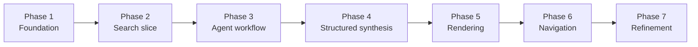

# Agentic Browser Implementation Plan

## Purpose

This document tracks **project progress**, **implementation phases**, and the recommended build order.

It focuses on **what has been implemented**, **what comes next**, and **how the project should be delivered over time**.

For architecture and design rationale, see `docs\design.md`.

## Current Checkpoint

The `main` branch is currently at the foundation checkpoint:

- project scaffold is in place
- FastAPI boots locally
- environment-backed configuration exists
- `GET /` and `GET /health` are implemented
- baseline tests verify startup and health behavior

## Phase Overview

## Phase Roadmap

### Phase 1: Foundation

Scope:

- project scaffold
- FastAPI app bootstrap
- environment configuration
- root and health routes
- initial tests

Status: complete

### Phase 2: Search Slice

Scope:

- normalized search models
- search service abstraction
- search route
- tests for route and normalization behavior

Status: next

### Phase 3: Agent Workflow

Scope:

- planner state and decision model
- search, fetch, and extraction nodes
- bounded orchestration layer
- tests for workflow transitions

Status: planned

### Phase 4: Structured Synthesis

Scope:

- evidence packet assembly
- structured page schema
- synthesis step producing page data instead of free text

Status: planned

### Phase 5: Rendering

Scope:

- render structured page data into HTML
- webpage-style layout for summaries, sections, citations, and media

Status: planned

### Phase 6: Context-Aware Navigation

Scope:

- preserve page and evidence context
- feed follow-up prompts and clicks back into the workflow

Status: planned

### Phase 7: Refinement

Scope:

- better source selection
- better image and style extraction
- latency, caching, and quality improvements

Status: planned

## Recommended Build Order

1. Complete the search slice.
2. Add an explicit agent workflow with planner and retrieval nodes.
3. Add structured synthesis output.
4. Add rendering from structured page data.
5. Add navigation and context continuity.
6. Improve relevance, quality, and performance.

## Near-Term Next Step

The next practical milestone is **Phase 2: Search Slice**.

That phase should produce:

- a search provider integration
- normalized result models
- a debug-friendly route for retrieval inspection
- tests for success and error behavior

## Definition of Done by Milestone

### Search slice done

- search requests return normalized results
- provider failures map to explicit errors
- route behavior is covered by tests

### Agent workflow done

- planner returns a structured decision
- the workflow can trigger retrieval when needed
- state moves predictably across workflow steps

### Structured synthesis done

- evidence is converted into validated page data
- the response format is stable enough for rendering

### Rendering done

- structured page data is converted into a webpage-like HTML response
- citations and navigation links are preserved in the rendered output

### Navigation done

- follow-up interactions reuse context when appropriate
- users can drill deeper without restarting from scratch

## Notes

- keep the implementation local-first and simple to run
- prefer additive refactors over rewrites
- keep the public README lightweight and move detailed planning here
