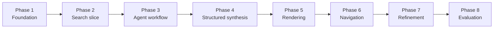

# Agentic Browser Implementation Plan

## Purpose

This document tracks **project progress**, **implementation phases**, and the recommended build order.

It focuses on **what has been implemented**, **what comes next**, and **how the project should be delivered over time**.

For architecture and design rationale, see `docs\design.md`.

## Current Checkpoint

The current branch now includes:

- FastAPI application bootstrap
- environment-backed configuration
- `GET /`, `GET /health`, `GET /search`, `POST /agent`, `POST /agent/render`, `GET /agent/pages/{session_id}/{page_id}`, and `GET /agent/follow-up`
- Tavily-backed search integration
- Azure AI Foundry-backed planner and synthesis options using GPT-4.1 mini
- a standalone Azure AI Foundry connection-check script for validating the deployment before exercising the planner flow
- normalized search, agent, and page models
- an initial LangGraph workflow with planner, search, fetch, extraction, synthesis, and finalize nodes
- an LLM-backed synthesis path with deterministic fallback
- a deterministic HTML renderer for synthesized page output, now with a more polished visual hierarchy and synthesis-status badge treatment
- a lightweight in-memory navigation store with page and session identifiers
- runtime request, workflow, planner, synthesis, and debug-gated raw LLM-response logging
- config-driven absolute internal page links via `APP_BASE_URL` for local development
- tests for health, search, planner behavior, synthesis parsing/fallback behavior, graph execution, page-model validation, HTML rendering, and navigation continuity

What is still missing from the long-term target:

- richer navigation behavior beyond the initial continuity slice
- improved rendering quality and richer render strategies

## Phase Overview

## Phase Roadmap

### Phase 1: Foundation

Scope:

- project scaffold
- FastAPI app bootstrap
- environment configuration
- root and health routes
- initial tests

Status: complete

### Phase 2: Search Slice

Scope:

- normalized search models
- search service abstraction
- Tavily-backed search route
- tests for route and normalization behavior

Status: complete as an initial slice

### Phase 3: Agent Workflow

Scope:

- planner state and decision model
- search, fetch, and extraction nodes
- bounded LangGraph orchestration
- `POST /agent`
- tests for workflow transitions and route behavior

Status: initial slice implemented

### Phase 4: Structured Synthesis

Scope:

- evidence packet assembly
- structured page schema
- synthesis step producing page data instead of free text

Status: initial slice implemented

### Phase 5: Rendering

Scope:

- render structured page data into HTML
- webpage-style layout for summaries, sections, citations, related links, and media

Status: initial slice implemented

### Phase 6: Context-Aware Navigation

Scope:

- preserve page and evidence context
- feed follow-up prompts and clicks back into the workflow

Status: initial slice implemented

### Phase 7: LLM Intelligence In The Agent Flow

Scope:

- LLM-backed planner reasoning over prompt plus page/session context
- explicit tool-use decisions for whether and how to use web search
- LLM-backed structured page synthesis
- controlled webpage generation with LLM-provided image/style hints
- later intelligent follow-up link generation

Status: planner and initial synthesis slices implemented and developer-ready for local validation

### Phase 8: Rendering and UX Refinement

Scope:

- improve visual rendering quality
- refine browser-like navigation UX
- improve layout/style handling on top of LLM hints

Status: initial styling refresh started on top of the deterministic renderer

### Phase 9: Evaluation and Optimization

Scope:

- quality evaluation
- latency tuning
- caching
- cost controls
- robustness improvements

Status: planned

## Planned Phase 7 Workflow Shape

```mermaid
flowchart LR
    Start((START)) --> ContextNode[load_context]
    ContextNode --> PlannerNode[llm_planner]

    PlannerNode -->|answer_from_context| SynthesizeNode[llm_synthesize]
    PlannerNode -->|search_needed| SearchNode[search]
    PlannerNode -->|refine_then_search| RewriteNode[query_rewrite]

    RewriteNode --> SearchNode
    SearchNode --> SelectSources[select_rank_sources]
    SelectSources --> FetchSources[fetch_sources]
    FetchSources --> ExtractSources[extract_sources]
    ExtractSources --> SynthesizeNode

    SynthesizeNode --> ImageNode[select_images]
    ImageNode --> FollowupsNode[generate_followups]
    FollowupsNode --> RenderNode[controlled_render]
    RenderNode --> Finalize
    Finalize --> End((END))
```

## Recommended Build Order

1. Add explicit tool-use orchestration and query refinement inside the graph.
2. Add intelligent follow-up link generation.
3. Improve image/style handling, browser-like UX refinement, and robustness.
4. Improve relevance, latency, and operational robustness.

## Near-Term Next Step

The next practical milestone is **Phase 7A: explicit tool orchestration and query refinement**.

The planner and synthesis slices are now in place and locally testable. The next implementation step should produce:

- explicit query-refinement behavior when the planner selects `refine_and_search`
- clearer graph-level tool orchestration based on planner intent
- retention of the current bounded synthesis/rendering contracts
- a later sub-phase for intelligent follow-up links

## Definition of Done by Milestone

### Search slice done

- search requests return normalized results
- provider failures map to explicit errors
- route behavior is covered by tests

### Agent workflow done

- planner returns a structured decision
- the workflow can trigger retrieval when needed
- state moves predictably across workflow steps

### Structured synthesis done

- evidence is converted into validated page data
- the response format is stable enough for rendering

### Rendering done

- structured page data is converted into a webpage-like HTML response
- citations and navigation links are preserved in the rendered output

### Navigation done

- follow-up interactions reuse context when appropriate
- users can drill deeper without restarting from scratch

### LLM intelligence done

- the planner is no longer purely heuristic when Azure AI Foundry planner configuration is present
- the graph can reason before deciding whether to search
- the planner path is locally observable through logs and a standalone connectivity check
- synthesis can now produce `SynthesizedPage` output through an Azure AI Foundry path with deterministic fallback
- controlled rendering can now consume LLM-generated image/style hints while staying template-driven

## Notes

- keep the implementation local-first and simple to run
- prefer additive refactors over rewrites
- keep the public README lightweight and move detailed progress tracking here
