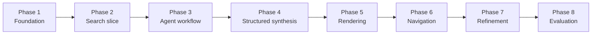
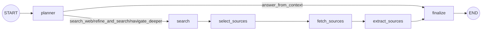

# Agentic Browser Implementation Plan

## Purpose

This document tracks **project progress**, **implementation phases**, and the recommended build order.

It focuses on **what has been implemented**, **what comes next**, and **how the project should be delivered over time**.

For architecture and design rationale, see `docs\design.md`.

## Current Checkpoint

The current `main` branch now includes:

- FastAPI application bootstrap
- environment-backed configuration
- `GET /`, `GET /health`, `GET /search`, and `POST /agent`
- Tavily-backed search integration
- normalized search and agent models
- an initial LangGraph workflow with planner, search, fetch, and extraction nodes
- runtime request and workflow logging
- tests for health, search, planner behavior, and graph execution

What is still missing from the long-term target:

- structured page synthesis
- final HTML rendering from a page schema
- context-aware navigation across generated pages

## Phase Overview

## Phase Roadmap

### Phase 1: Foundation

Scope:

- project scaffold
- FastAPI app bootstrap
- environment configuration
- root and health routes
- initial tests

Status: complete

### Phase 2: Search Slice

Scope:

- normalized search models
- search service abstraction
- Tavily-backed search route
- tests for route and normalization behavior

Status: complete as an initial slice

### Phase 3: Agent Workflow

Scope:

- planner state and decision model
- search, fetch, and extraction nodes
- bounded LangGraph orchestration
- `POST /agent`
- tests for workflow transitions and route behavior

Status: initial slice implemented

### Phase 4: Structured Synthesis

Scope:

- evidence packet assembly
- structured page schema
- synthesis step producing page data instead of free text

Status: next

### Phase 5: Rendering

Scope:

- render structured page data into HTML
- webpage-style layout for summaries, sections, citations, and media

Status: planned

### Phase 6: Context-Aware Navigation

Scope:

- preserve page and evidence context
- feed follow-up prompts and clicks back into the workflow

Status: planned

### Phase 7: Refinement

Scope:

- better source selection
- better image and style extraction
- latency, caching, and quality improvements

Status: planned

### Phase 8: Evaluation and Optimization

Scope:

- quality evaluation
- latency tuning
- caching
- cost controls
- robustness improvements

Status: planned

## Current Workflow Shape

## Recommended Build Order

1. Add structured synthesis output from extracted evidence.
2. Add a validated page schema for rendering.
3. Add rendering from structured page data.
4. Add navigation and context continuity.
5. Improve relevance, quality, and performance.

## Near-Term Next Step

The next practical milestone is **Phase 4: Structured Synthesis**.

That phase should produce:

- a validated page-data schema
- a synthesis step that turns evidence into structured output
- deterministic tests around output shape and failure handling
- a clean handoff into the future rendering layer

## Definition of Done by Milestone

### Search slice done

- search requests return normalized results
- provider failures map to explicit errors
- route behavior is covered by tests

### Agent workflow done

- planner returns a structured decision
- the workflow can trigger retrieval when needed
- state moves predictably across workflow steps

### Structured synthesis done

- evidence is converted into validated page data
- the response format is stable enough for rendering

### Rendering done

- structured page data is converted into a webpage-like HTML response
- citations and navigation links are preserved in the rendered output

### Navigation done

- follow-up interactions reuse context when appropriate
- users can drill deeper without restarting from scratch

## Notes

- keep the implementation local-first and simple to run
- prefer additive refactors over rewrites
- keep the public README lightweight and move detailed progress tracking here
